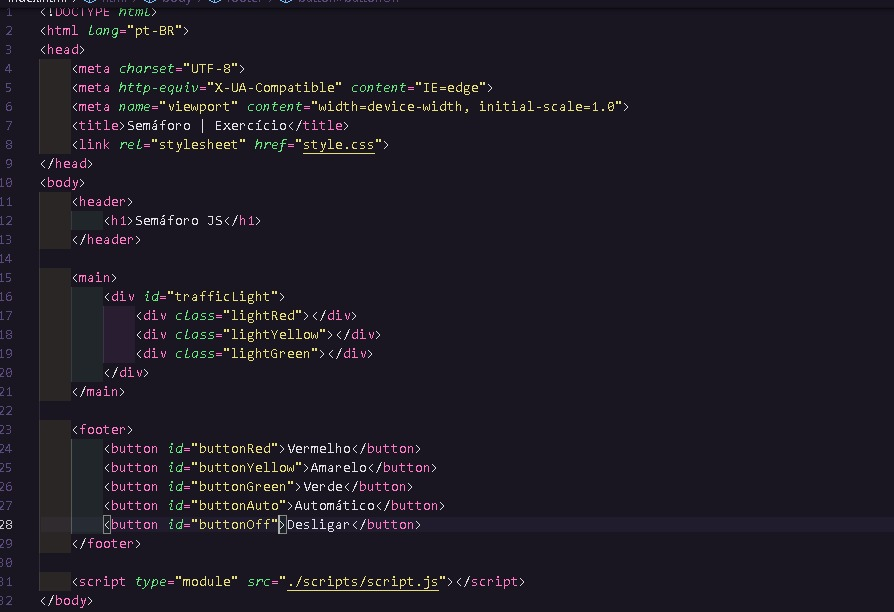
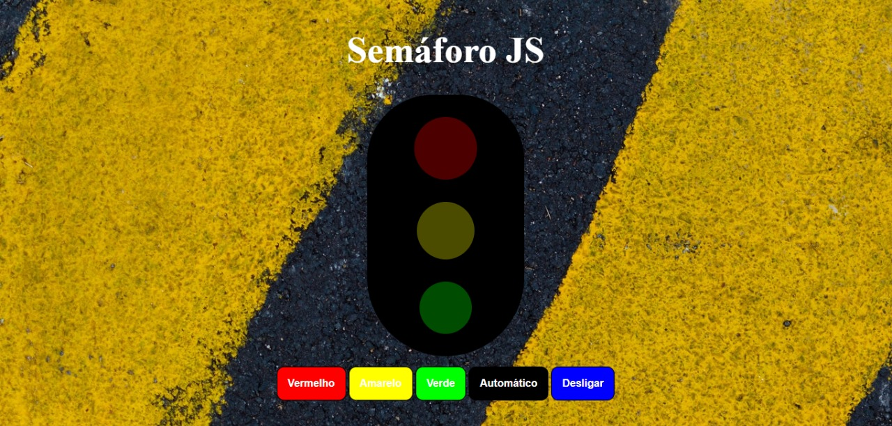
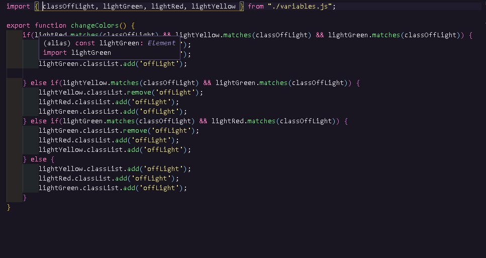
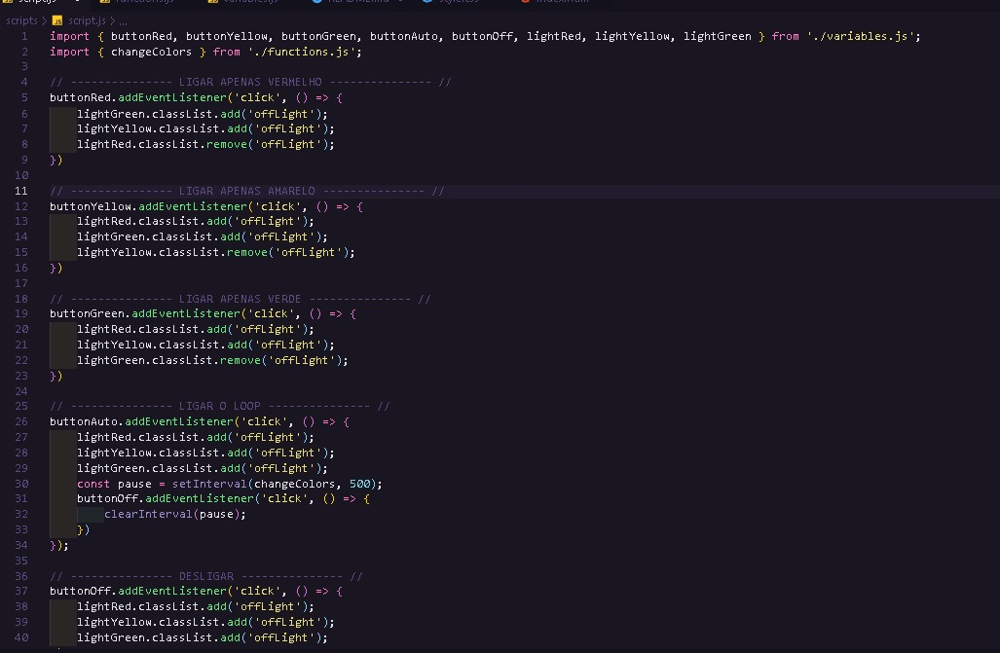

# Semáforo

Estava, como sempre, pesquisando projetos para reproduzir e achei um de semáforo.
Fiz primeiramente com imagens, mostrei pra um amigo e ele me recomendou que fizesse tudo na mão, e assim fiz.

## Como ocorreu:

Comecei com o html e css e fiz algo simples, um h1, o semáforo e os buttons. (O estilo seria muitos prints então não tirei)

#### E foi assim que ficou 

#### Após isto fui pro código...

Comecei pelas variáveis...

Depois fui para as funções gerais e, ja estava na mente fazer a função de loop fora (as duas abaixo)

Como sempre, deu alguns probleminhas para fazer (principalmente o loop), mas felizmente saiu como eu esperava e consegui mais um projeto para meu portfólio.

## Link aplicação (hospedado no netlify):

https://serene-ptolemy-567d4e.netlify.app/